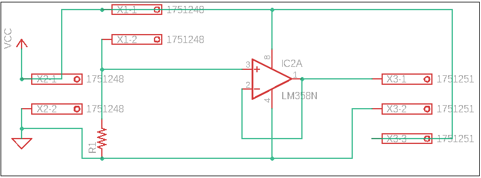
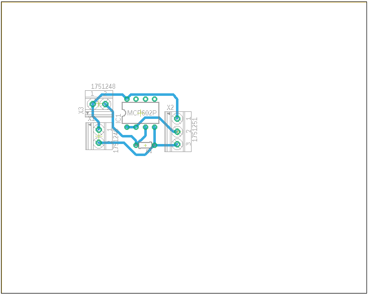

# 🖐️ Tactile Sensor with Force Sensitive Resistor (FSR)

A **low-cost tactile sensing system** using **Force Sensitive Resistors (FSRs)** as input, designed to measure applied pressure and convert it into a digital signal.  
This project provides **hardware schematics, PCB layouts, and Arduino firmware** for implementing a tactile sensor interface.

---

## 📌 Project Overview

This project explores the design and implementation of a **tactile sensor module** based on FSR input circuits.  
Two amplifier configurations are compared:

- **LM358-based amplifier**  
- **MCP602-based amplifier**

Both designs aim to provide **stable, noise-resistant** readings from the FSR sensor, which are then monitored via Arduino.

---

## ⚡ Features
- Arduino-based FSR monitoring firmware (`FSR_Monitor.ino`)  
- Hardware schematics (`.sch`) and PCB layouts (`.brd`)  
- Support for **LM358** and **MCP602** op-amp circuits  
- Visual reference: schematic diagrams and PCB board previews  

---

## 🛠️ Hardware Design

📂 **`/hardware` folder includes:**
- `FSR Input LM358.sch` & `FSR Input LM358.brd`  
- `FSR Input MCP602.sch` & `FSR Input MCP602.brd`  
- `eagle.epf` (Eagle project file)  

📂 **`/image` folder includes:**
- `Schematic_lm358.png`  
- `Schematic_mcp602.png`  
- `board_lm358.png`  
- `board_mcp602.png`  

Example Schematic (LM358):  

  

Example PCB Layout (MCP602):  

  

---

## 💻 Arduino Firmware

The `code/FSR_Monitor.ino` provides real-time monitoring of sensor values.

```cpp
// Example snippet from FSR_Monitor.ino
int fsrPin = A0;
int fsrReading;

void setup() {
  Serial.begin(9600);
}

void loop() {
  fsrReading = analogRead(fsrPin);
  Serial.println(fsrReading);
  delay(100);
}
```

👉 Full code available in [`code/FSR_Monitor.ino`](./code/FSR_Monitor.ino)

---

## 🚀 Applications

* Robotic tactile sensing  
* Grip force measurement  
* Human-computer interaction (HCI)  
* Pressure-sensitive switches  

---

## 🔮 Potential Improvements

* Add calibration curves for force vs resistance  
* Implement multi-FSR array sensing  
* Integrate wireless data transmission (BLE / WiFi)  

---

## 🔬 Op-Amp Comparison: LM358 vs MCP602

| Specification        | **LM358**                          | **MCP602**                                  |
|----------------------|------------------------------------|---------------------------------------------|
| **Op-Amp Type**      | Dual Operational Amplifier         | Dual Operational Amplifier                   |
| **Supply Voltage**   | 3V – 32V (single supply)           | 2.7V – 6V (single supply)                    |
| **Input Offset**     | ±7 mV (typical)                    | ±2 mV (typical)                              |
| **Input Bias Current** | ~20 nA                           | ~1 pA                                        |
| **Bandwidth (GBW)**  | 1 MHz                              | 10 MHz                                       |
| **Slew Rate**        | 0.3 V/µs                           | 7 V/µs                                       |
| **Input Impedance**  | ~2 MΩ                              | >10 TΩ (very high)                           |
| **Output Drive**     | Can drive medium load              | Stronger, suitable for precision sensing     |
| **Advantages**       | Cheap, easy to find                | Low noise, fast, great for ADC/sensors       |
| **Drawbacks**        | Slower, higher noise               | Limited supply voltage (max 6V)              |

---

## 📄 License

This project is licensed under the [MIT License](LICENSE).

[](https://opensource.org/licenses/MIT)  
[](https://www.arduino.cc/)  
[]()  
[](https://www.autodesk.com/products/eagle/)  
[]()  

---


## 💡 Tips (Brick Section)

- Use **MCP602** if precision and low-noise operation are required.  
- Use **LM358** if cost and flexible supply voltage are the main concerns.  
- Add a **pull-down resistor** for more stable readings.  
- Calibrate the FSR before using it in real-world applications.  
